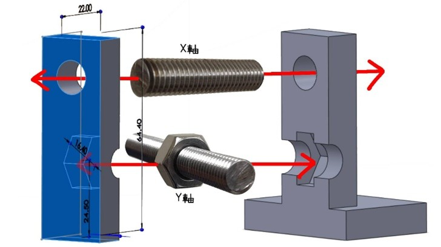

[中文版本](README.md)
# Intelligent Two-Dimensional Linear Motion CNC Plotter

This project presents the design, fabrication, and application of an intelligent two-dimensional linear motion CNC plotter. It is part of the **Undergraduate Summer Engineering Practice Program** at National Taiwan Ocean University.

- **Research Institution**: Department of Electrical Engineering, National Taiwan Ocean University
- **Advisor**: Prof. Chih-Yung Cheng
- **Team Members**: Hsin-Wei Lin, Rou-Yin Chen

---
## Introduction
The goal of this project is to design and build an intelligent CNC plotting platform that uses an Arduino microcontroller to control stepper motors and servo motor ,and lead screws achieving high-precision two-dimensional motion control.  
The platform supports automatic drawing and style transfer features, enabling drawing control and lead screw movement via G-code transmission from a computer.

---
## System Block Daigram

---
## Project Features
- High-precision two-dimensional motion control
- Support for G-code command input
- Image style transfer capability
- Supports multiple interchangable drawing pens

---
## Materials Used
| Component          | Specification/Model                |
|--------------------|------------------------------------|
| Development Board  | Arduino UNO                        |
| Stepper Motor      | NEMA 17, 1.7A x 2                  |
| Servo Motor        | SG90                               |
| Mechanical Part    | Aluminum profile, Metal lead screw |
| Power Supply       | 17V DC                             |

---
## Research Methodology
The hardware utilizes V-slot slides and a screw-driven gantry, combined with an Arduino Uno and an A4988 + stepper motor to control the X-Y axes. A servo motor drives the pen tip upwards and downwards. The support and pen holder are 3D printed. The software, written in Python, integrates OpenCV for image processing, rembg for background removal, Potrace for vector path generation, and the Gemini API for style transfer. The system supports multiple drawing modes and can output G-code after optimizing the path. Preview, export, and machine control are all handled through a custom GUI.

---
## Customed Designs
Below are the custom-designed components (screw holders), which were designed by using SolidWorks. These holders can stabilize the motion of screws when stepper motors are functioning.

## Results Showcase
[Demonstration Video](https://youtu.be/Qn8gQQk7WbQ)  

Video list：https://youtube.com/playlist?list=PLaIR_ZBq24bLc04j9EN7dDOz_OjDmvVbR&si=acX-4c2rYGbPTH4s

.exe files download：https://drive.google.com/drive/folders/1rkEolvtHetP7o12V0WMiVoSxgUWzMbsR?usp=drive_link

[Result Image File](https://github.com/Aynslielin/CNC-Plotter-Machine/tree/main/Result_Images)  
Result Images:  

  

  
  
  
  

---
## References
1.	Arduino. 2025. Download and install Arduino IDE [Internet]. [cited 2025 Sep 2]. Available from: https://support.arduino.cc/hc/en-us/articles/360019833020-Download-and-install-Arduino-IDE

2.	Bolt Taiwan. 2023. 機械螺桿規格表 (Thread data chart) [Internet]. [cited 2025 Sep 2]. Available from: https://bolt-tw.com/technical-information/thread-data-chart/machine-screw/

3.	Chen Fuguo. 2017. A4988步進電機驅動模組使用教學 [Internet]. [cited 2025 Sep 2]. Available from: https://chenfuguo.gitbooks.io/arduino/content/Shields/a4988Controller.html

4.	Cheung Xiongwei. 2024. GRBL的源碼解析 [Internet]. CSDN. [cited 2025 Sep 2]. Available from: https://blog.csdn.net/cheungxiongwei/article/details/135983786

5.	Chris Lee. 2024. 如何使用 Gemini API [Internet]. Medium. [cited 2025 Sep 2]. Available from: https://chrislee0728.medium.com/%E5%A6%82%E4%BD%95%E4%BD%BF%E7%94%A8-gemini-api-4458fecbd50f

6.	Data Science Collective. 2025. Turning real photos into Ghibli-style art with Google’s Gemini API for free [Internet]. Medium. [cited 2025 Sep 2]. Available from: https://medium.com/data-science-collective/turning-real-photos-into-ghibli-style-art-with-googles-gemini-api-for-free-e5ddf5949d0e

7.	Digi-Key Forum. 2022. Stepper motor and lead screw discussion [Internet]. [cited 2025 Sep 2]. Available from: https://forum.digikey.com/t/topic/22819

8.	DIY 3D Print. 2013. Adjusting current limit on A4988 stepper driver [Internet]. [cited 2025 Sep 2]. Available from: https://diy3dprint.blogspot.com/2013/11/4988.html

9.	Gnea. 2024. Grbl v1.1 commands [Internet]. GitHub. [cited 2025 Sep 2]. Available from: https://github.com/gnea/grbl/wiki/Grbl-v1.1-Commands

10.	Gnea. 2018. Compiling Grbl via the Arduino IDE [Internet]. GitHub. [cited 2025 Sep 2]. Available from: https://github.com/gnea/grbl/wiki/Compiling-Grbl#via-the-arduino-ide-all-platforms-recommended-for-all-users

11.	Google AI. 2025. Gemini API Quickstart (Python) [Internet]. [cited 2025 Sep 2]. Available from: https://ai.google.dev/gemini-api/docs/quickstart?lang=python&hl=zh-tw

12.	Google AI Studio. 2025. Gemini API Key 管理 [Internet]. [cited 2025 Sep 2]. Available from: https://aistudio.google.com/apikey

13.	Instructables. 2020. GRBL losing steps: 5 simple tips to fix it fast [Internet]. [cited 2025 Sep 2]. Available from: https://www.instructables.com/GRBL-Losing-Steps-5-Simple-Tips-to-Fix-It-Fast--1/

14.	Manuals+. 2021. GRBL CNC Arduino Uno manual (wiring guide) [Internet]. [cited 2025 Sep 2]. Available from: https://manuals.plus/cndy-shield/grbl-cnc-arduino-uno-manual

15.	OctoPrint. 2025. OctoPrint: Open source 3D printer controller [Internet]. GitHub. [cited 2025 Sep 2]. Available from: https://github.com/OctoPrint/OctoPrint

16.	Pololu Forum. 2017. CNC shield and A4988 stepper driver discussion [Internet]. [cited 2025 Sep 2]. Available from: https://forum.pololu.com/t/cnc-shield-and-a-4988-stepper-driver/12686

17.	Pololu Forum. 2011. A4988 heating problem discussion [Internet]. [cited 2025 Sep 2]. Available from: https://forum.pololu.com/t/a4988-stepper-motor-driver-carrier-heating-problem/3474

18.	Potrace. 2019. Potrace: Transforming bitmaps into vector graphics [Internet]. [cited 2025 Sep 2]. Available from: https://potrace.sourceforge.net/

19.	Robottini. 2015. GRBL-servo [Internet]. GitHub. [cited 2025 Sep 2]. Available from: https://github.com/robottini/grbl-servo

20.	Taichi Maker. 2017. Arduino驅動A4988步進電機教學 [Internet]. [cited 2025 Sep 2]. Available from: http://www.taichi-maker.com/homepage/reference-index/motor-reference-index/arduino-a4988-nema-stepper-motor/

21.	Thingiverse. 2017. Drawing Robot project [Internet]. [cited 2025 Sep 2]. Available from: https://www.thingiverse.com/thing:2349232

22.	維度科技. 2025. Klipper 與 Marlin 差異比較 [Internet]. [cited 2025 Sep 2]. Available from: https://diman.tw/news-Detail/klipper-vs-marlin-difference

23.	Arduino Forum. 2023. Drivers on CNC shield heating up fast [Internet]. [cited 2025 Sep 2]. Available from: https://forum.arduino.cc/t/drivers-on-cnc-shield-heating-up-fast/1182255/4

24.	Arduino Forum. 2022. Overheating stepper motor controllers [Internet]. [cited 2025 Sep 2]. Available from: https://forum.arduino.cc/t/overheating-stepper-motor-controllers/963394

25.	A4988的工作原理，引腳和功能 [Internet]. [Cited 2025 Sep 8]. Available from: https://www.ariat-tech.tw/blog/a4988-working-principle,pinout-and-features.html

---
